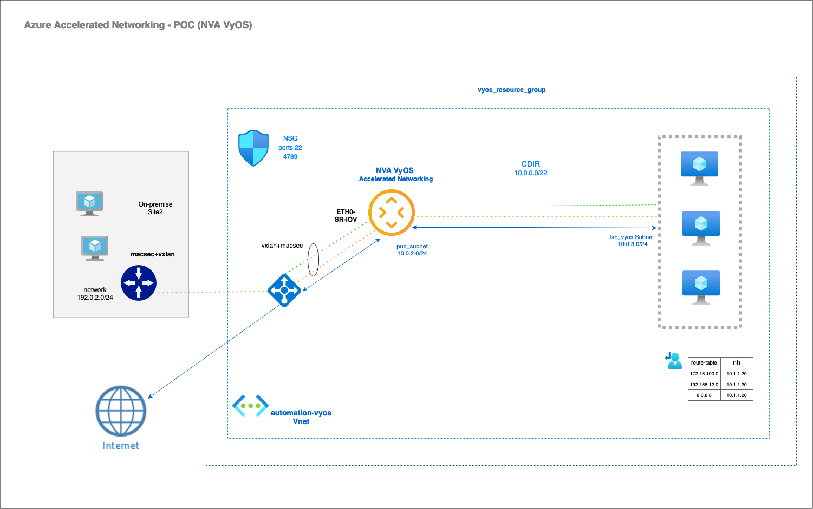

# Azure Accelerated Networking automation with Terraform

Terraform Module to create a Resource Group  with Azure Virtual Network (VNet), subnets accross one public
and interfaces with Azure Accelareted networkting activated.

To connected our VyOS router , we need to create the proper ssh public/private key and the public KEY should stored in files/key.pub.

The VM VyOS instance in the public subnet is assigned from the
the intenret via port 22 (for ssh), user is vyos by default.


This module allows you to generate a public ip address and associate it with our VyOS instance.

## High level diagram on Azure



## Current state

Modules:

- main: Sets up a Vnet with Subnets, 1 public subnets, Network security Groups  and interfaces with acceleration network, public ip address.
- VMs: Currently creates a VM with vyos(vyos-1.4.0, where the version can be defined by variable) public/private subnet.
- rsa key pub key must be use to connected our vm, user is: vyos


## Requirements

| Name | Version |
|------|---------|
| terraform | >= 1.2.5 |
| hashicorp/azurerm | >= 3.93.0 |

## Providers

| Name | Version |
|------|---------|
| hashicorp/azurerm | >= 3.93.0 |

## Usage

To run this example you need to execute:

```bash
$ terraform init
$ terraform plan
$ terraform apply
```

## Inputs

| Name | Description | Type | Default | Required |
|------|-------------|------|---------|:--------:|
| namespace | The project namespace to use for unique resource naming | `string` | `"automation-vyos"` | no |
| location | location form azure zone  | `string` | `"West Europe"` | yes |
| resource_group | The name of your RG| `string` | `"vyos_resource_group"` | yes |
| cidr | cidr is used for virtual-network| `string` | `""10.0.0.0/22"` | yes |
| pub_subnets | network public that it is used for virtual-network| `string` | `"10.0.2.0/24"` | yes |
| hostname | The name of your VM | `string` | `"vyosaz01new"` | yes |
| vyos_image_id | vyos version used for our VM | `string` | `"1.4.0"` | yes |


